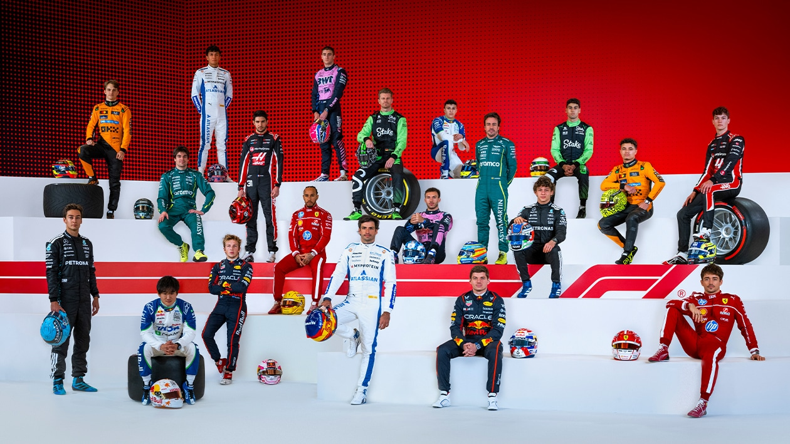

# F1

  

## Formula 1: Data Analysis and Podium Prediction 

### Project Overview

Formula 1 (F1) is the highest level of international motorsport, where drivers compete in the fastest single seater cars. Races combine speed, strategy, and technology. 

In Formula 1, the margin between winning and losing is often measured in fractions of a second. Teams spend millions analyzing data to optimize pit strategies, tire management, and driver performance.

This project replicates that approach by answering two core questions:

1. What factors most influence a driver’s chance of finishing on the podium?

2. Can we build a machine learning model to predict podium finishes based on historical data?

